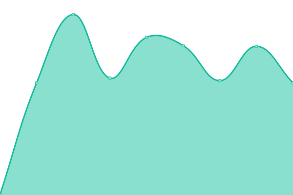

# [📈 Live Status](https://schaetzlein.github.io/upptime): <!--live status--> **🟩 All systems operational**

This repository contains the open-source uptime monitor and status page for [schaetzlein](https://schaetzlein.github.io/upptime), powered by [Upptime](https://github.com/upptime/upptime).

With [Upptime](https://upptime.js.org), you can get your own unlimited and free uptime monitor and status page, powered entirely by a GitHub repository. We use [Issues](https://github.com/schaetzlein/upptime/issues) as incident reports, [Actions](https://github.com/schaetzlein/upptime/actions) as uptime monitors, and [Pages](https://schaetzlein.github.io/upptime) for the status page.

<!--start: status pages-->
<!-- This summary is generated by Upptime (https://github.com/upptime/upptime) -->
<!-- Do not edit this manually, your changes will be overwritten -->
<!-- prettier-ignore -->
| URL | Status | History | Response Time | Uptime |
| --- | ------ | ------- | ------------- | ------ |
|  [EPLASS](https://www.eplass.de) | 🟩 Up | [eplass.yml](https://github.com/schaetzlein/upptime/commits/HEAD/history/eplass.yml) | 

 866ms
     
 | 

<a href="https://schaetzlein.github.io/upptime/history/eplass">100.00%</a>
    

|  [EPLASS Portal](https://portal.eplass.de) | 🟩 Up | [eplass-portal.yml](https://github.com/schaetzlein/upptime/commits/HEAD/history/eplass-portal.yml) | 

 1360ms
     
 | 

<a href="https://schaetzlein.github.io/upptime/history/eplass-portal">100.00%</a>
    

|  [SYSTEL Portal](https://db-cde.eplass.de) | 🟩 Up | [systel-portal.yml](https://github.com/schaetzlein/upptime/commits/HEAD/history/systel-portal.yml) | 

 1346ms
     
 | 

<a href="https://schaetzlein.github.io/upptime/history/systel-portal">100.00%</a>
    

|  [EPLASS InfoClient](https://infoclient.eplass.de) | 🟩 Up | [eplass-info-client.yml](https://github.com/schaetzlein/upptime/commits/HEAD/history/eplass-info-client.yml) | 

 820ms
     
 | 

<a href="https://schaetzlein.github.io/upptime/history/eplass-info-client">100.00%</a>
    

|  [EPLASS File](https://file.eplass.de) | 🟩 Up | [eplass-file.yml](https://github.com/schaetzlein/upptime/commits/HEAD/history/eplass-file.yml) | 

 1077ms
     
 | 

<a href="https://schaetzlein.github.io/upptime/history/eplass-file">100.00%</a>
    

|  [EPLASS Cloud](https://cloud.eplass.de) | 🟩 Up | [eplass-cloud.yml](https://github.com/schaetzlein/upptime/commits/HEAD/history/eplass-cloud.yml) | 

 858ms
     
 | 

<a href="https://schaetzlein.github.io/upptime/history/eplass-cloud">100.00%</a>
    

<!--end: status pages-->

[**Visit our status website →**](https://schaetzlein.github.io/upptime)

## 📄 License

- Powered by: [Upptime](https://github.com/upptime/upptime)
- Code: [MIT](./LICENSE) © [schaetzlein](https://schaetzlein.github.io/upptime)
- Data in the `./history` directory: [Open Database License](https://opendatacommons.org/licenses/odbl/1-0/)
